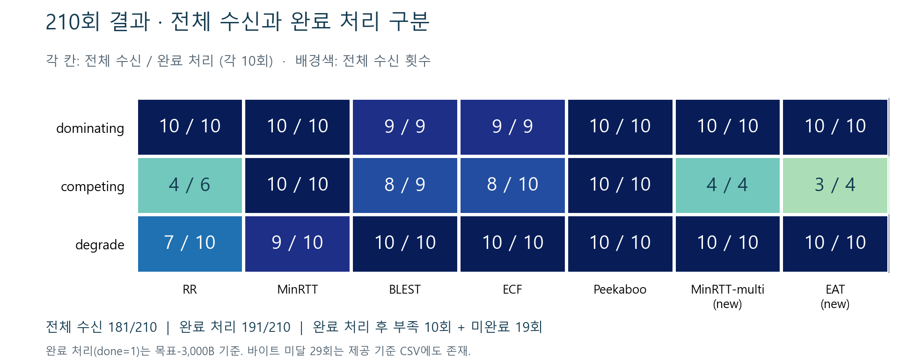

# 1주차 보고서 — 트러블슈팅 반영 (2026-10-01)

## 수행 결과

- WSL 2·Ubuntu 작업 환경 구성 / 설치 스크립트 빌드·63회 빠른 검증 완료
- 3시나리오 × 7스케줄러 × 10seed = 210회 실행 / 요약표·그림 생성
- 제공 수정 스택 CSV와 9개 시뮬레이션 필드 일치 / 21개 그룹 완료율·평균 FCT 편차 0
- dominating/RR 평균 3.27331초 / 기준 3.27초 ±5% 충족
- 완료 처리 191/210 / 정확 목표 바이트 수신 181/210 / 미완료 19건·완료 처리 후 부족 10건은 제공 기준 CSV에도 존재

## 트러블슈팅

- **최초 미통과:** 고정 5Mbps·50ms·Peekaboo / 5,242,880B 전체 수신 3/3 / 9.4560초로 기준 8.5~9.0초 미달
- **문제:** 초기 검증 조건이 원본 실행 스크립트의 5~6Mbps·50~55ms·RR과 달라 직접 비교가 맞지 않았음
- **조치:** 원본 인자 확인 → 조건별 통제 실험 → 원본 링크 조건으로 정렬 / 목표량 5,242,880B·손실률 0·OLIA 유지
- **미통과 시도:** 5~5.5Mbps에서 9.0262~9.0568초 / 5,000,000B에서 9.0382초 / RR만 변경 시 9.4560초로 차이 없음
- **재검증 성공:** seed 1~10 / 8.6050~8.7201초·평균 8.6756초 / 전체 바이트 수신·시간 범위 10/10 충족
- **변경 범위:** 기본 비활성 관찰 옵션·재현 도구 추가 / 전송·스케줄러 알고리즘 유지 / 관찰 전후 IP 추적 일치
- **환경 문제 조치:** Matplotlib 인자 호환 패치 적용 → 재설치 종료 코드 0 / 수신 시각 출력 부재 → 수동 계측 추가

## 판정·기록 보존

- 최초 게이트 1 미달 기록·CSV·로그 보존
- 요청서에서 링크 범위가 생략되어 원본 스크립트를 근거로 재검증 / 원본 조건에서 게이트 1 수치 기준 충족
- 고정 5Mbps 결과는 계속 9.4560초 / 조건 차이 해소에 따른 재현이며 고정 5Mbps 성능 개선과 구분
- 원인 분석 39회 + 관찰 비활성 대조 1회 / 39행 고유 조합·전체 수신 검증 완료
- 코드 분석 브랜치: `lab/w1-one-path-diagnosis-20261001` / 분석 코드 커밋 `f2ed7be4e9e87325aaee82ce75351b5f08c0aab8`
- 2주차 30-seed 실험 미시작

## 보고용 시각화

- FCT 분포: 완료 처리(`done=1`) 실행만 표시 / 각 스케줄러의 완료 수·전체 수 함께 확인

- 전체 수신 / 완료 처리 횟수: 181/210과 191/210 구분 / 각 칸은 전체 수신 수 / 완료 처리 수

- 단일 경로: 최초 고정 5Mbps의 미통과와 원본 링크 조건 재검증 구분 / 모든 표시 실행은 5,242,880B 전체 수신

- 그림은 기존 CSV로 생성 / 추가 시뮬레이션 없음 / 노션 보고서에도 본문 이미지 3개 첨부

## 산출물

- [코드·산출물 인덱스](README.md)
- [최초 검증 보고서](week1-2026-10-01/1주차_보고서.md) / [210회 CSV](week1-2026-10-01/w1.csv) / [요약표](week1-2026-10-01/w1_summary.csv) / [그림](week1-2026-10-01/w1_fct.png)
- [원인 분석 보고서](one-path-analysis-2026-10-01/REPORT.md) / [39회 통합 CSV](one-path-analysis-2026-10-01/all_experiments.csv) / [검증 JSON](one-path-analysis-2026-10-01/validation.json)
- [1주차 노션 보고서](https://app.notion.com/p/3eb5698e257e815f9031ccc630fe0864) / [시도별 분석](https://app.notion.com/p/3ec5698e257e815bb1a9e362b6d6d262)
