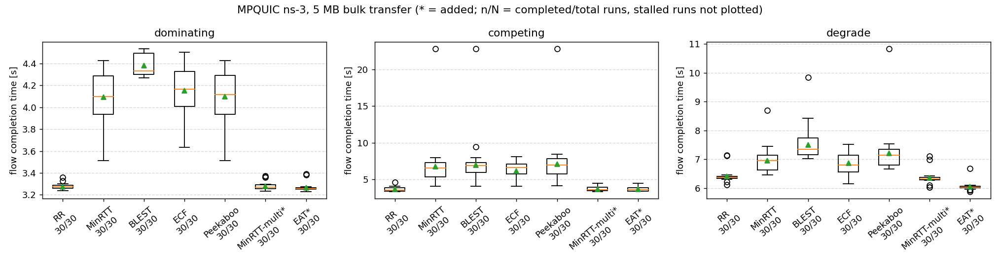
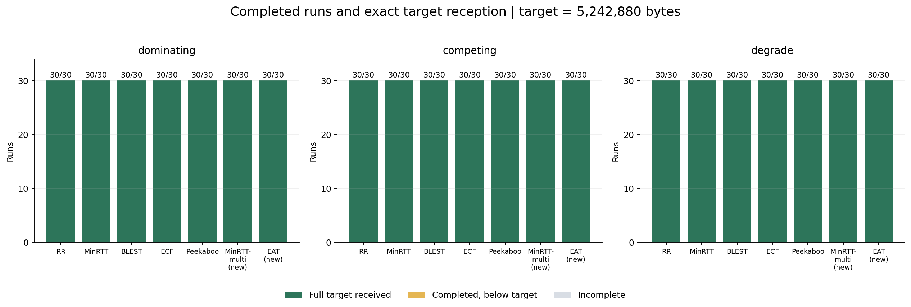
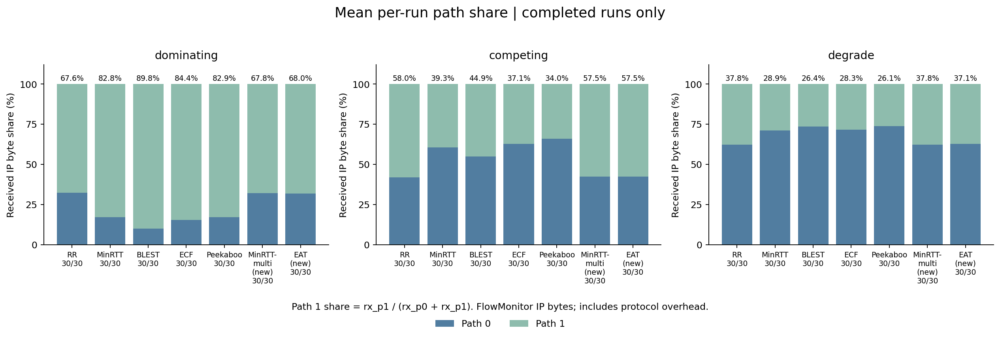

# 2주차 공식 기준값 SET

- 사용 범위: 이후 스케줄러 성능 비교의 기준 데이터
- 실행 규모: 3시나리오 × 7스케줄러 × seed 1~30 = 630회
- 완료 처리: 630/630회. 목표 5,242,880B 전체 수신: 630/630회
- 측정 구성: 제공 01+02 패치와 공통 수신·재전송 수정·FIN 처리 보존 적용, 종료 대기 250ms
- 전송 시간 FCT: 데이터 전송 시작부터 코드 완료 판정까지. 완료 판정은 목표량−3,000B 기준이며 종료 대기 시간은 FCT에 포함하지 않음
- 비교 유지 설정: OLIA, 목표량 5,242,880B, 설정 손실률 0, 동일 시나리오·seed, 시뮬레이션 종료 제한 60초, CompletionGraceMs=250
- 주 비교 스케줄러: MinRTT-multi. 다른 스케줄러도 같은 공통 통신 코드·설정으로 측정

## 최종 측정 결과·통계

- 각 시행 원본 측정값 : https://github.com/JS-KETI/MPQUIC_Scheduler_Lab/blob/fix/%239-week2-incomplete-diagnosis/artifacts/week2-completion-2026-10-08/run-01/results.csv
- 기준값 측정 파일 : https://github.com/JS-KETI/MPQUIC_Scheduler_Lab/blob/fix/%239-week2-incomplete-diagnosis/artifacts/week2-completion-2026-10-08/run-01/baseline.csv
- 기준값 통계 (21개 조합별 평균·중앙값·p90·완료율·95% 신뢰구간) : https://github.com/JS-KETI/MPQUIC_Scheduler_Lab/blob/fix/%239-week2-incomplete-diagnosis/artifacts/week2-completion-2026-10-08/run-01/analysis/summary.csv
- 같은 seed끼리 스케줄러 비교 통계 : https://github.com/JS-KETI/MPQUIC_Scheduler_Lab/blob/fix/%239-week2-incomplete-diagnosis/artifacts/week2-completion-2026-10-08/run-01/analysis/paired_comparisons.csv

## 기본 시각화

- 전송 시간 박스플롯: 제공 sched-lab/analyze.py로 생성
- 완료율·경로 비율: sched-lab/plot_baseline.py로 생성. 경로 비율은 IP 수신 바이트 기준으로 헤더·재전송 포함
- 새 시뮬레이션 없이 동일한 630회 측정값으로 통계 확인·그림 생성

## 재현·동결 기록

- baseline.csv: results.csv와 바이트가 동일한 공식 기준 측정 파일
- commands.json·provenance.json·effective-code.patch·environment.json·logs/: 실제 실행 인자·코드 버전·변경 패치·환경·630회 실행 로그
- validation.json·comparison.json: 실행 조합·수신량·이전 10ms 결과와의 비교
- analysis/baseline-visualization-provenance.json: 입력 해시·생성 명령·도구 해시
- FROZEN.json·SHA256SUMS: 공식 기준 지정·동결 상태·파일 무결성. 이 폴더를 변경하지 않고 다음 실험은 새 폴더에 저장
- 이후 비교에서는 CompletionGraceMs=250을 명시. 시뮬레이션 코드의 기본값은 10ms

## 기준 검토 결과

- dominating의 MinRTT-multi 신뢰구간 폭: 0.0257초, 요청 기준 0.1초 이하 충족
- MinRTT·ECF·Peekaboo는 0.1초 초과. 요청서의 신뢰구간 적용 대상은 확인 필요
- 기존 동결 artifacts/week2-2026-10-02/run-01/은 최초 측정 이력으로 보존
- 제공 결과는 최초 기준 스택의 seed 1~10에 한해 존재. 수정 후 전체 630회는 이 저장소의 추가 측정 결과
