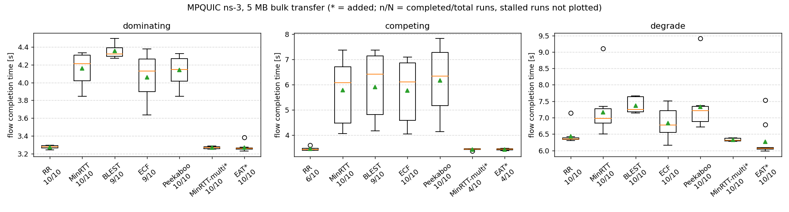
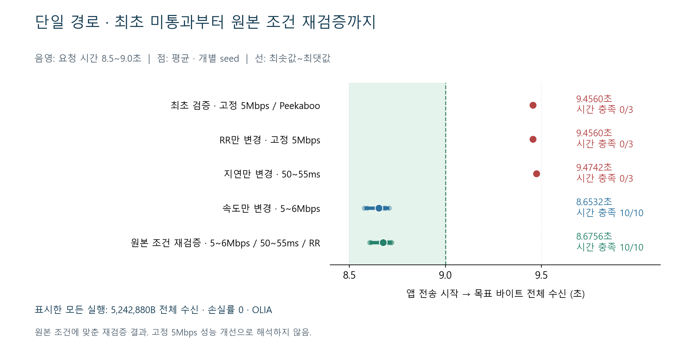

## 1. 1주차 작업 내용

### 1-1. 작업 환경 설치·빠른 실행 테스트 (환경 구성 완료·63회 기준값 일치)

| 검증 항목 | 결과 |
|---|---|
| WSL 2·Ubuntu 작업 환경 | 구성 완료 |
| `setup.sh` 설치·빌드 | 그래프 생성 인자 호환 문제 수정 후 정상 완료, 종료 코드 0 |
| 빠른 실행: 3시나리오 × 7스케줄러 × 3seed | 63회 모두 실행, 완료 처리 61/63, 기준 CSV와 63회 측정값 일치 |

- Windows 안에 Linux 실행 환경인 WSL 2·Ubuntu 구성 → `setup.sh`로 코드 설치·빌드 → `run_sweep.py`로 63회 빠른 실행 확인
- seed는 난수 초기값. 같은 실험 조건에 서로 다른 seed를 적용해 결과를 반복 측정
- **설치 중 그래프 생성 오류 조치**
  - 현상: 제공 `analyze.py`의 그래프 생성 단계에서 실행 오류
  - 원인: 그래프 축 이름 인자 `tick_labels`와 설치된 Matplotlib 버전의 호환 차이
  - 조치: 해당 환경에서 지원하는 `labels` 인자로 변경
  - 결과: 설치·빌드·그래프 생성 정상 완료, 중복·누락 없이 63개 결과 확보

### 1-2. 멀티 경로 스케줄러 성능 테스트 (기준값 데이터와 모두 일치)

- 목적: 두 경로를 사용하는 환경에서 7개 스케줄러의 전송 시간·완료 횟수 비교
- `run_sweep.py`와 `analyze.py` 사용 → **3시나리오 × 7스케줄러 × 10seed 실행 → 210개 결과·요약·그림 생성**
- 공통 조건: 제공 스케줄러·스택 수정 패치 01+02, 손실률 0, OLIA 혼잡 제어(전송 속도 조절), 목표 5,242,880B
- 시나리오별 링크 조건을 고정하고 스케줄러·seed를 바꿔 반복 실행
- 그림의 세로축은 앱 전송 시작부터 코드의 완료 판정까지 걸린 시간. 삼각형은 평균, 박스 중앙선은 중앙값, 이름 아래 숫자는 완료 처리 횟수/전체 실행 횟수
- 미완료 실행은 시간 분포에서 제외하고, 완료 처리·전체 수신 횟수는 1-4에서 별도 확인

### 1-3. 제공 기준 데이터 재현 테스트 (210회 측정값 일치·그룹 편차 0)

| 비교 대상 | 결과 |
|---|---|
| 210회 결과의 시뮬레이션 지표 9개 | 제공 기준 CSV와 모두 일치 |
| 21개 시나리오·스케줄러 그룹 | 평균 전송 시간·완료율 편차 0 |

- 목적: 구축한 환경에서 제공 기준 데이터와 같은 결과가 나오는지 확인
- 같은 시나리오·스케줄러·seed의 결과를 대조 → 누락·중복·실행 오류 0건, 5% 초과 편차 0건
- PC에서 실행에 걸린 실제 시간 합계: 이번 70.6초, 제공 데이터 154.8초. 스케줄러 비교에는 시뮬레이션 내부의 전송 시간을 사용

### 1-4. 멀티 경로 완료 처리·전체 수신 확인 (수신 결과도 제공 기준 데이터와 일치)

- **완료 처리 191/210회**: 수신량이 5,239,880B 이상이면 코드가 완료로 판정(`done=1`). 목표보다 최대 3,000B 부족한 상태도 포함
- **전체 수신 181/210회**: 목표 5,242,880B를 정확히 모두 수신(`rx_app == size`)
- **바이트 미달 29건**
  - **완료 처리됐지만 전체 수신 미달 10건**
  - **완료 기준 미충족 19건**
- 기준 재현 결과: 29건의 발생 조합·seed·수신량도 제공 기준 CSV와 동일. 210회 모두 정상 실행되고 결과가 기록됨
- 확인된 종료 동작: 완료 판정 후 10ms가 지나면 시뮬레이션 종료. 기준에 도달하지 못한 실행은 설정된 종료 시각까지 진행
- 추가 분석 대상: 완료 처리된 10건의 잔여 바이트와 미완료 19건의 전송 정체 원인
- 그림의 각 칸은 **전체 수신 횟수 / 완료 처리 횟수**이며, 조합당 전체 실행 횟수는 10회

### 1-5. 시나리오·스케줄러별 결과 (각 조합 10회 반복)

- 시나리오는 경로 상태를 정한 실험 환경. 각 시나리오에서 스케줄러별로 seed 1~10을 적용해 10회씩 반복
- 시간 단위는 초. 평균·중앙값·p90은 완료 처리된 실행 기준이며, p90은 측정 시간의 90%가 그 이하인 값

**dominating: 빠르고 지연이 짧은 경로가 동일** — 완료 처리 68/70, 전체 수신 68/70

| 스케줄러 | 완료 처리 | 전체 수신 | 평균 | 중앙값 | p90 |
|---|---|---|---|---|---|
| RR | 10/10 | 10/10 | 3.2733 | 3.2755 | 3.2908 |
| MinRTT | 10/10 | 10/10 | 4.1632 | 4.2134 | 4.3300 |
| BLEST | 9/10 | 9/10 | 4.3579 | 4.3233 | 4.4771 |
| ECF | 9/10 | 9/10 | 4.0607 | 4.1307 | 4.3548 |
| Peekaboo | 10/10 | 10/10 | 4.1426 | 4.1494 | 4.3226 |
| MinRTT-multi(new) | 10/10 | 10/10 | 3.2667 | 3.2678 | 3.2824 |
| EAT(new) | 10/10 | 10/10 | 3.2685 | 3.2607 | 3.2840 |

**competing: 빠른 경로와 지연이 짧은 경로가 서로 다름** — 완료 처리 53/70, 전체 수신 47/70

| 스케줄러 | 완료 처리 | 전체 수신 | 평균 | 중앙값 | p90 |
|---|---|---|---|---|---|
| RR | 6/10 | 4/10 | 3.4533 | 3.4325 | 3.5335 |
| MinRTT | 10/10 | 10/10 | 5.7806 | 6.0809 | 7.1727 |
| BLEST | 9/10 | 8/10 | 5.9052 | 6.4103 | 7.1949 |
| ECF | 10/10 | 8/10 | 5.7681 | 6.1106 | 7.0609 |
| Peekaboo | 10/10 | 10/10 | 6.1679 | 6.3346 | 7.6773 |
| MinRTT-multi(new) | 4/10 | 4/10 | 3.4258 | 3.4419 | 3.4501 |
| EAT(new) | 4/10 | 3/10 | 3.4299 | 3.4341 | 3.4602 |

**degrade: 도중에 유리한 경로의 성능 열화** — 완료 처리 70/70, 전체 수신 66/70

| 스케줄러 | 완료 처리 | 전체 수신 | 평균 | 중앙값 | p90 |
|---|---|---|---|---|---|
| RR | 10/10 | 7/10 | 6.4315 | 6.3459 | 6.4885 |
| MinRTT | 10/10 | 9/10 | 7.1611 | 6.9815 | 7.5242 |
| BLEST | 10/10 | 10/10 | 7.3720 | 7.2429 | 7.6516 |
| ECF | 10/10 | 10/10 | 6.8400 | 6.7723 | 7.3540 |
| Peekaboo | 10/10 | 10/10 | 7.3337 | 7.2134 | 7.5736 |
| MinRTT-multi(new) | 10/10 | 10/10 | 6.3286 | 6.3143 | 6.3798 |
| EAT(new) | 10/10 | 10/10 | 6.2709 | 6.0633 | 6.8675 |

- 세 시나리오의 완료 처리 합계: dominating 68/70, competing 53/70, degrade 70/70
- 표준편차·95% 수신 시간·경로별 수신 비율과 seed별 원시 값:

- 그룹 요약 CSV : https://github.com/JS-KETI/MPQUIC_Scheduler_Lab/blob/main/artifacts/week1-2026-10-01/w1_summary.csv
- 210회 원시 CSV : https://github.com/JS-KETI/MPQUIC_Scheduler_Lab/blob/main/artifacts/week1-2026-10-01/w1.csv

## 2. 핵심 기준값 검증 결과 (대표 2개 조건 모두 충족)

| 검증 대상·조건 | 측정값 | 완료·수신 및 기준 대조 |
|---|---|---|
| dominating 시나리오·RR | 평균 3.2733초 | 완료 처리 10/10, 기준 3.27초 ±5% 충족 |
| 단일 경로·5~6Mbps·50~55ms·RR | 평균 8.6756초 | 전체 수신 10/10, 10회 모두 8.5~9.0초 충족 |

- 요청서의 대표 전송 시간과 대조. 단일 경로는 제공 실행 스크립트의 링크 조건을 적용하고 목표 5,242,880B 전체 수신까지 측정

## 3. 단일 경로 전송 시간 비교 (고정 5Mbps 9.4560초·원본 조건 평균 8.6756초)

- **비교 목적: 링크 설정에 따라 5 MB 전송 시간이 어떻게 달라지는지 확인**
  - 코드 기본값: 고정 5Mbps·지연 50ms·Peekaboo. 최초 측정도 같은 값을 실행 인자로 지정
  - 제공 `exp-wns3-one-path.sh`: 속도 5~6Mbps·지연 50~55ms·RR
  - 요청서는 목표량·시간 기준을 제시. 링크 속도·지연·스케줄러는 제공 실행 스크립트에서 확인
- **전체 수신까지 걸린 시간 비교**
  - 고정 5Mbps·50ms·Peekaboo: 목표 5,242,880B 전체 수신 **3/3회**, 전송 시간 **9.4560초**
  - 원본 링크 조건 5~6Mbps·50~55ms·RR: 전체 수신 **10/10회**, 평균 **8.6756초**, 범위 **8.6050~8.7201초**
- **통제 실험 (스케줄러 Peekaboo → RR 변경 후 테스트)**
  - 유지 조건: 고정 5Mbps·지연 50ms·목표 5,242,880B·손실률 0·OLIA
  - 결과: 전체 수신 3/3회, 시간은 **9.4560초로 동일**
- **통제 실험 (속도 고정 5Mbps → 5~6Mbps 변경 후 테스트)**
  - 유지 조건: RR·지연 50ms·목표 5,242,880B·손실률 0·OLIA
  - 결과: 전체 수신 10/10회, 평균 **8.6532초로 단축**
  - 원인 확인: 비교한 조건에서 스케줄러 변경보다 링크 속도 설정이 전송 시간 차이의 주요 요인으로 확인
- **실행·기록 방법: 조건을 지정하고 수신 시각을 추가 기록**
  - `one-path-investigate.py`로 속도·지연·스케줄러·목표량을 지정해 반복 실행하고 명령·측정 CSV·로그 보관
  - 주요 비교에서 목표 5,242,880B·손실률 0·OLIA 유지. 목표량 변경 보조 실험은 3-1에 구분
  - 기존 실행 인자 적용 기능 사용. 전송·스케줄러 알고리즘은 유지하고 수신량별 도착 시각·링크 조건을 기록하는 옵션 추가
  - 기록 옵션은 기본 꺼짐. 기록을 켜고 끈 실행의 IP 패킷 송수신 추적이 일치함을 확인

### 3-1. 단일 경로 통제 실험 (스케줄러·속도·지연·목표량 변경 후 테스트)

| 테스트 조건·변경 항목 | 전체 수신 | 전송 시간 |
| --- | --- | --- |
| 고정 5Mbps·50ms·Peekaboo | 3/3 | 9.4560초 |
| 고정 5Mbps·50ms에서 스케줄러만 RR로 변경 | 3/3 | 9.4560초 |
| 고정 5Mbps·RR에서 지연만 50~55ms로 변경 | 3/3 | 평균 9.4742초 |
| 50ms·RR에서 속도만 5~6Mbps로 변경 | 10/10 | 평균 8.6532초 |
| 원본 조건 5~6Mbps·50~55ms·RR·목표량 5,242,800B | 10/10 | 평균 8.6754초 |
| 원본 링크 조건 5~6Mbps·50~55ms·RR·목표량 5,242,880B | 10/10 | 평균 8.6756초 |
| 보조 검증: 속도 5~5.5Mbps | 3/3 | 9.0262~9.0568초 |
| 보조 검증: 목표량 5,000,000B | 1/1 | 9.0382초 |

- 고정 속도·속도 범위·전송량별 측정값·실행 명령·로그 보존

### 3-2. 수신량별 도착 시각 측정 (고정 5Mbps의 전송 진행 과정 확인)

- 목적: 첫 데이터 수신부터 전체 수신까지, 수신량별 도착 시각 확인. 아래 시간은 모두 앱 전송 시작 이후 경과 시간

| 고정 5Mbps에서 측정한 수신 시점 | 앱 시작 후 시간 |
|---|---|
| 첫 앱 데이터 수신 | 0.1590초 |
| 목표량의 95% 수신 | 9.0051초 |
| 5,000,000B 수신 | 9.0399초 |
| 목표량보다 3,000B 적게 수신 | 9.4524초 |
| 목표 5,242,880B 전체 수신 | 9.4560초 |

- 원본 링크 조건 5~6Mbps·50~55ms·RR의 전체 수신 시간: 중앙값 8.6826초, p90 8.7152초. 전체 수신과 요청 시간 범위를 모두 충족한 실행 10/10

### 3-3. 수신 기록 옵션의 동작 영향 확인 (기록 추가 전후 패킷 추적 일치)

| 검증 항목 | 결과 |
|---|---|
| 최초 수신 시각 기록 코드 추가 전후(04 패치) | seed 1의 IP 패킷 송수신 추적 일치 |
| 수신·링크 기록 끔(`Diag=0`) | 이전 실행과 표준 출력·IP 패킷 추적 일치 |
| 수신·링크 기록 켬(`Diag=1`) | 이전 실행과 IP 패킷 추적 일치 |
| 조건별 반복 실험 39회 + 기록을 끈 비교 실행 1회 | 조건·seed 조합 39개 중복·누락 0, 전체 수신 39/39 |
| 빌드·변경 패치 검사 | 빌드 성공, `git diff --check`·패치 역적용 검사 통과 |

- 목적: 수신 시각을 기록하는 코드 추가가 전송 동작에 영향을 주는지 확인
- 관찰 옵션의 기본값은 비활성. 기록 활성·비활성 비교에서 패킷 추적 일치 확인

## 4. 다음 주 계획 (630회 반복 측정·비교 기준 데이터 확정)

- 3시나리오 × 7스케줄러 × 30seed로 630회 실행 → 완료율·평균·중앙값·p90 전송 시간 정리
- dominating 평균 전송 시간의 95% 신뢰구간 폭이 0.1초 이하인지 확인 → 2주차 통과 기준 판정 후 비교 기준 데이터 확정·보관

**관련 자료**

- 수정 브랜치 : https://github.com/JS-KETI/MPQUIC_Scheduler_Lab/tree/docs/%236-week1-report-clarity
- 1주차 보고서 HTML : https://github.com/JS-KETI/MPQUIC_Scheduler_Lab/blob/main/reports/week1/WEEK1_WEEKLY_REPORT.html
