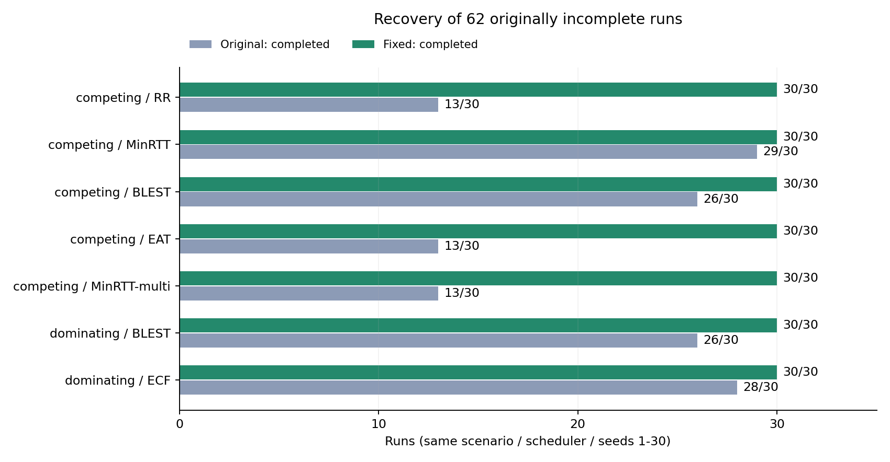

## 1. 2주차 미완료 원인 분석

### 1-1. 조사 대상·제공 기준 대조 (미완료 62회, 실행 오류 0회)

- 조사 대상: `mpquic-sched-lab.cc`의 3시나리오 × 7스케줄러 × seed 1~30, 총 630회 중 미완료 62회
- 원본 완료 처리 568/630, 목표 5,242,880B 전체 수신 533/630. 완료 처리는 목표보다 3,000B 부족해도 인정
- 제공 기준 seed 1~10의 210회: 완료 191회·전체 수신 181회, 미완료 19회의 조합·seed·수신량도 동일
- 추가 seed 11~30의 420회: 완료 377회·전체 수신 352회, 미완료 43회. 해당 범위의 제공 기준 없음
- 데이터 전송 시작: 시뮬레이션 시각 1초. 종료: 60초 또는 완료 처리 10ms 후. 미완료는 코드가 자동 기록
- 목표의 95%까지 받은 미완료 54회, 그 이전에 정체한 미완료 8회를 나눠 조사

## 2. 원인별 변경·대조 테스트

### 2-1. 통제 실험 (종료 시각 60초 → 300초 변경 후 테스트: 62회 수신량 동일)

- **최초 문제 상황: 종료 시각 60초까지 완료 기준 미충족**
  - 조사 대상: 원본 미완료 62회
- **문제 원인 추정: 전송을 끝내기 위한 시간이 부족**
  - 링크·스케줄러·seed·목표량·혼잡 제어를 유지하고 종료 시각만 연장
- **문제 원인 검증: 300초까지 대기해도 수신량 변화 없음**
  - 완료 0/62. 원본 60초의 애플리케이션 수신량과 62회 모두 동일
- **조치: 제한 시간 연장 대신 수신 버퍼·손실 복구 처리 조사**
  - 실제 데이터 위치와 패킷 송수신·ACK(수신 확인) 번호를 추적

### 2-2. 소켓 읽기 바이트 차감 수정 A (별도 결함 수정, 미완료 62회에는 효과 없음)

- **최초 문제 상황: 읽기 버퍼에서 지운 항목을 다시 참조**
  - `QuicSocketRxBuffer::Extract()`의 삭제 후 참조 및 남은 읽기 크기 계산 오류 확인
- **문제 원인 추정: 읽기 단계에서 실제 바이트가 누락**
  - 서로 다른 크기의 데이터 13B·7B·31B를 넣고 전체 읽기·제한된 읽기 검사
- **문제 원인 검증: 이 함수만 수정해도 원본 미완료 결과는 동일**
  - 62회 완료 0/62, 수신량 변화 0회. 별도 회귀 테스트의 바이트 수·순서 오류는 수정 후 통과
- **조치: 삭제 전 바이트 차감·부분 읽기 적용**
  - 수신 버퍼의 바이트 보존 결함을 함께 수정. 62회 정체의 직접 원인과 구분

### 2-3. 이미 전달한 스트림 데이터의 중복·겹침 처리 수정 B (54회 전체 수신 회복)

- **최초 문제 상황: 수신 위치는 진행했지만 애플리케이션에 전달한 바이트는 부족**
  - 마지막 구간에서 정체한 54회에 이미 전달한 위치의 중복 프레임 관찰
- **문제 원인 추정: 과거 중복 데이터가 순서 대기 버퍼 앞에 남음**
  - 새 연속 데이터를 계산해도 앞의 중복 데이터를 추출하거나 추출에 실패. 계산한 수신 위치만 증가
- **문제 원인 검증: 스트림 수신 처리만 수정 후 동일 62회 테스트**
  - 완료·전체 수신 54/62. 앞에서 정체한 8회는 그대로
- **조치: 이미 전달한 범위 제외·일부 겹친 프레임의 새 바이트만 처리**
  - `QuicStreamBase::Recv()`에서 실제 추출한 바이트 수만 수신 위치에 반영
- **조치 후 검증 결과: 54회 목표 5,242,880B 정확 수신**
  - 회귀 테스트: 과거 중복·부분 겹침·대기 중 동일 프레임·역순 수신의 실제 바이트 순서까지 확인

### 2-4. ACK 번호를 이용한 손실 감지 수정 C (나머지 8회 전체 수신 회복)

- **최초 문제 상황: 특정 바이트 위치의 데이터가 누락되고 재전송되지 않음**
  - dominating/BLEST 4회·ECF 2회, competing/BLEST 2회
- **문제 원인 추정: 네트워크에서 버린 데이터의 손실 판단이 생략**
  - 가장 큰 ACK 번호가 데이터 전송 목록에 없으면 이전 미확인 데이터의 손실 검사도 생략
- **문제 원인 검증: 패킷 폐기와 재전송 누락을 독립 추적**
  - 8회 모두 기본 FqCoDel 큐가 지연 목표 초과로 첫 IPv4 조각을 폐기. 나머지 조각만 도착해 패킷 재조립 실패
  - 설정 손실률 0은 별도 오류 모델의 값. 큐의 지연 제어 폐기는 실제 로그로 확인
  - 손실 감지만 수정해 8/8 완료·전체 수신. 7회는 누락 위치 재전송·수신 직접 확인
  - competing/BLEST/seed 12는 앞선 손실 처리 후 전송 시각이 바뀌어 후속 누락 회피
- **조치: 미확인 패킷과 가장 큰 ACK 번호의 차이로 직접 손실 판단**
  - `QuicSocketTxBuffer::OnAckUpdate()` 수정. 기존 패킷 번호 차이 임계값 3·혼잡 제어 유지
- **조치 후 검증 결과: 8회 목표량 전체 수신, 손실 감지 회귀 테스트 통과**
  - ACK 전용 패킷의 번호가 데이터 목록에 없을 때도 오래된 누락 데이터를 재전송

## 3. 수정 후 630회 전체 검증

### 3-1. 동일 seed·동일 링크 조건 테스트 (완료 630/630, 전체 수신 621/630)

- A·B·C 결합 후 동일한 630회 재실행. 실행 오류·누락·중복 0건
- **기존 미완료 62회: 모두 완료 처리·목표량 전체 수신**
- **전체 완료 처리: 568/630 → 630/630**
- **전체 수신: 533/630 → 621/630**
- 목표량 5,242,880B·완료 임계량 5,239,880B·손실률 0·OLIA·60초 종료·완료 후 10ms 대기 유지

| 시나리오 | 스케줄러 | 원본 완료 | 원본 전체 수신 | 수정 완료 | 수정 전체 수신 |
|---|---|---|---|---|---|
| competing | RR | 13/30 | 11/30 | 30/30 | 30/30 |
| competing | MinRTT | 29/30 | 24/30 | 30/30 | 29/30 |
| competing | BLEST | 26/30 | 22/30 | 30/30 | 29/30 |
| competing | ECF | 30/30 | 24/30 | 30/30 | 29/30 |
| competing | Peekaboo | 30/30 | 26/30 | 30/30 | 30/30 |
| competing | EAT | 13/30 | 10/30 | 30/30 | 30/30 |
| competing | MinRTT-multi | 13/30 | 11/30 | 30/30 | 30/30 |
| degrade | RR | 30/30 | 26/30 | 30/30 | 27/30 |
| degrade | MinRTT | 30/30 | 29/30 | 30/30 | 29/30 |
| degrade | BLEST | 30/30 | 30/30 | 30/30 | 30/30 |
| degrade | ECF | 30/30 | 30/30 | 30/30 | 30/30 |
| degrade | Peekaboo | 30/30 | 30/30 | 30/30 | 30/30 |
| degrade | EAT | 30/30 | 30/30 | 30/30 | 30/30 |
| degrade | MinRTT-multi | 30/30 | 27/30 | 30/30 | 28/30 |
| dominating | RR | 30/30 | 30/30 | 30/30 | 30/30 |
| dominating | MinRTT | 30/30 | 29/30 | 30/30 | 30/30 |
| dominating | BLEST | 26/30 | 26/30 | 30/30 | 30/30 |
| dominating | ECF | 28/30 | 28/30 | 30/30 | 30/30 |
| dominating | Peekaboo | 30/30 | 30/30 | 30/30 | 30/30 |
| dominating | EAT | 30/30 | 30/30 | 30/30 | 30/30 |
| dominating | MinRTT-multi | 30/30 | 30/30 | 30/30 | 30/30 |

### 3-2. 완료 후 기록 종료 테스트 (대기 10ms → 250ms 변경: 부족 9회 모두 전체 수신)

- **10ms 기록 종료 시 목표량 미달 9회**
  - **원본에서도 부족한 실행: 5회**
  - **원본은 전체 수신이었지만 수정 후 부족한 실행: 4회**
- 동일 9회에서 완료 판정 후 대기만 250ms로 연장 → 9/9 전체 수신, 기록된 완료 시간은 모두 동일
- 기본 대기 10ms 유지. 630회 전체 결과와 별도 9회 대기 연장 결과를 구분해 보관
- 부족 조합: competing의 MinRTT/seed 8·BLEST/seed 16·ECF/seed 23, degrade의 RR/seed 4·6·19·MinRTT/seed 9·MinRTT-multi/seed 17·22

### 3-3. 원본에서도 완료한 seed의 시간 비교 (일부 전송 시간 증가)

- 같은 스케줄러·시나리오·seed에서 양쪽 모두 완료한 568회: 더 빠름 135회·동일 266회·더 느림 167회
- competing의 MinRTT-multi: 공통 완료 13회에서 평균 +0.3035초. 양쪽 모두 전체 수신한 11회에서도 평균 +0.3183초
- 양쪽 모두 전체 수신한 degrade/Peekaboo/seed 28: 7.0503초 → 10.8214초
- 완료율 회복과 함께 시간 증가 확인. 손실 복구에 따른 재전송·혼잡 제어 변화를 추가 추적할 대상
- 21개 조합의 공통 완료 수·평균 차이·95% 신뢰구간·부호 순위 검정·승패 seed 수를 별도 CSV에 보존

### 3-4. 비판 검토·관찰 도구 검증 (다른 에이전트의 독립 추적과 대조)

- 비판 검토 에이전트가 원인별 가설·폐기 패킷 번호·재전송·수신 위치와 시간 증가를 별도 확인
- 관찰 코드 켜기 전후 동일 62회의 9개 측정값 모두 일치
- 수신 바이트 수뿐 아니라 실제 바이트 순서를 확인하는 회귀 테스트: 원본 실패 → 수정 후 모두 통과
- 비판 검토에서 중복 데이터에 처음 붙은 FIN(스트림 종료 표식) 누락 위험 발견 → 종료 표식 먼저 처리하도록 보완
- FIN 포함 중복 데이터의 종료 상태·바이트 수·순서 검사 통과. 최종 코드로 630회 재실행해 앞선 수정 결과와 9개 측정값 모두 동일
- 동결 기준 폴더의 해시 목록 27개 모두 유지. 수정 결과는 별도 폴더·브랜치에 보관

## 4. 개선 방법·다음 조사 대상

- 채택한 수정: 이미 전달한 중복 데이터 제외, ACK 전용 번호에서도 손실 감지, 소켓 읽기의 바이트 보존
- 추가 방법: QUIC·UDP·IPv4 헤더까지 포함해 MTU(한 번에 전송하는 IP 패킷 크기) 이하로 송신 데이터 길이 제한. 조각 폐기 영향 줄이기 위한 별도 후보이며 미검증
- 추가 검증 범위: 대기 중인 서로 다른 프레임끼리의 부분 겹침, 선택형 시간 기반 손실 감지, 전송 시간이 증가한 실행의 재전송·혼잡 제어 경로
- 기존 01+02 패치의 동결 기준과 수정 A·B·C의 결과를 분리. 기준 데이터 교체·게이트 2 판정·3주차 진입은 별도 검토

## 5. 코드·측정 자료

- 수정 브랜치 : https://github.com/JS-KETI/MPQUIC_Scheduler_Lab/tree/fix/%239-week2-incomplete-diagnosis/
- 630회 수정 결과 : https://github.com/JS-KETI/MPQUIC_Scheduler_Lab/blob/fix/%239-week2-incomplete-diagnosis/artifacts/week2-incomplete-2026-10-07/14-fin-preservation-full-630/results.csv
- 62회 원인·제공 기준 범위 : https://github.com/JS-KETI/MPQUIC_Scheduler_Lab/blob/fix/%239-week2-incomplete-diagnosis/artifacts/week2-incomplete-2026-10-07/analysis/incomplete62_causes.csv
- 공통 완료 seed의 시간 변화 : https://github.com/JS-KETI/MPQUIC_Scheduler_Lab/blob/fix/%239-week2-incomplete-diagnosis/artifacts/week2-incomplete-2026-10-07/critical-review-paired-times.csv
- 독립 비판 검토 : https://github.com/JS-KETI/MPQUIC_Scheduler_Lab/blob/fix/%239-week2-incomplete-diagnosis/artifacts/week2-incomplete-2026-10-07/critical-review.md
- 전체 실험·명령·로그·패치 : https://github.com/JS-KETI/MPQUIC_Scheduler_Lab/tree/fix/%239-week2-incomplete-diagnosis/artifacts/week2-incomplete-2026-10-07
- 실행 도구 : https://github.com/JS-KETI/MPQUIC_Scheduler_Lab/blob/fix/%239-week2-incomplete-diagnosis/sched-lab/incomplete-investigate.py
- 중복·겹침 수신 수정 : https://github.com/JS-KETI/MPQUIC_Scheduler_Lab/blob/fix/%239-week2-incomplete-diagnosis/src/quic/model/quic-stream-base.cc
- ACK 손실 감지 수정 : https://github.com/JS-KETI/MPQUIC_Scheduler_Lab/blob/fix/%239-week2-incomplete-diagnosis/src/quic/model/quic-socket-tx-buffer.cc
- 소켓 읽기 수정 : https://github.com/JS-KETI/MPQUIC_Scheduler_Lab/blob/fix/%239-week2-incomplete-diagnosis/src/quic/model/quic-socket-rx-buffer.cc
- 패킷 추적 연결 : https://github.com/JS-KETI/MPQUIC_Scheduler_Lab/blob/fix/%239-week2-incomplete-diagnosis/src/quic/model/quic-socket-base.cc
- 실험·관찰 및 완료 후 대기 옵션 : https://github.com/JS-KETI/MPQUIC_Scheduler_Lab/blob/fix/%239-week2-incomplete-diagnosis/scratch/mpquic-sched-lab.cc
- 수신 바이트 순서 회귀 테스트 : https://github.com/JS-KETI/MPQUIC_Scheduler_Lab/blob/fix/%239-week2-incomplete-diagnosis/scratch/quic-rx-regression.cc
- 손실 재전송 회귀 테스트 : https://github.com/JS-KETI/MPQUIC_Scheduler_Lab/blob/fix/%239-week2-incomplete-diagnosis/scratch/quic-loss-regression.cc
- 실험 표·그림 생성 코드 : https://github.com/JS-KETI/MPQUIC_Scheduler_Lab/blob/fix/%239-week2-incomplete-diagnosis/artifacts/week2-incomplete-2026-10-07/generate_analysis.py
- 그림 SVG : https://github.com/JS-KETI/MPQUIC_Scheduler_Lab/blob/fix/%239-week2-incomplete-diagnosis/reports/week2/figures/incomplete_recovery.svg
- 수정 B 분리 패치 : https://github.com/JS-KETI/MPQUIC_Scheduler_Lab/blob/fix/%239-week2-incomplete-diagnosis/artifacts/week2-incomplete-2026-10-07/stream-rx-candidate.patch
- 수정 C 분리 패치 : https://github.com/JS-KETI/MPQUIC_Scheduler_Lab/blob/fix/%239-week2-incomplete-diagnosis/artifacts/week2-incomplete-2026-10-07/loss-detection-candidate.patch
- 수정 A 분리 패치 : https://github.com/JS-KETI/MPQUIC_Scheduler_Lab/blob/fix/%239-week2-incomplete-diagnosis/artifacts/week2-incomplete-2026-10-07/socket-rx-candidate.patch
