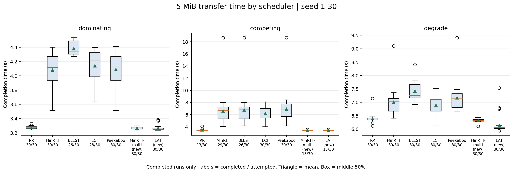
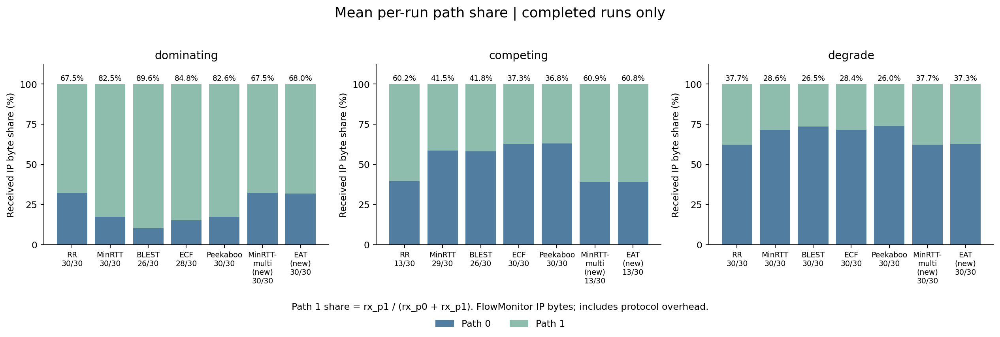

## 1. 2주차 작업 내용

### 1-1. 30 seed 반복 실행 테스트 (630회 측정·누락 및 실행 오류 0건)

| 항목 | 수행 조건·결과 |
|---|---|
| 실행 규모 | 3시나리오 × 7스케줄러 × seed 1~30 = 630회 |
| seed | 링크 속도·지연의 무작위 변화를 재현하는 번호. 같은 번호끼리 스케줄러 결과 비교 |
| 공통 조건 | 목표 5,242,880B, 손실률 0, OLIA 혼잡 제어, 송수신 버퍼 40,000,000B, 시뮬레이션 종료 시각 60초 |
| 실행 시간 | 전체 약 214.3초. 각 실행의 실제 소요 시간은 CSV의 wall_s에 기록 |
| 1주차 결과 재현 | seed 1~10의 210회·9개 측정 항목 모두 일치 |

- `run_sweep.py`와 `mpquic-sched-lab.cc`로 630회 연속 실행 → 중복·누락 없이 `baseline.csv` 630행 생성
- 스케줄러·전송 알고리즘과 기존 완료 조건 유지. 분석·그림 생성 도구 추가
- 1주차 대조 항목: 목표량, 완료 시간, 95% 수신 시간, 애플리케이션 수신량, 두 경로 수신량·지연, 완료 여부

### 1-2. 멀티 경로 전송 시간 비교 (완료 실행의 시간 분포·완료 횟수 함께 표시)

- `plot_baseline.py`로 시나리오별 시간 분포 생성 → 21개 조합 비교
- FCT(전송 완료 시간): 전송 시작부터 코드의 완료 기준에 도달할 때까지 걸린 시간
- 그림의 세모는 평균, 상자는 가운데 50% 구간. 각 이름 아래 숫자는 완료 처리 횟수와 실행 횟수
- competing의 seed 30에서 MinRTT·BLEST·Peekaboo가 각각 18.6596초 기록. 해당 결과를 포함해 평균·분포 계산

| 시나리오 | 두 경로의 조건 |
|---|---|
| dominating | 경로 1이 속도·지연 모두 유리. 경로 0: 5~5.5Mbps·50~55ms, 경로 1: 10~11Mbps·10~11ms |
| competing | 경로 0은 저지연, 경로 1은 고속. 경로 0: 5~5.5Mbps·10~11ms, 경로 1: 10~11Mbps·50~55ms |
| degrade | dominating 조건으로 시작. 전송 시작 1.5초 후 경로 1을 1Mbps·120ms로 변경 |

- 지연은 편도 기준. 속도·지연은 지정 범위에서 100ms마다 변경

### 1-3. 완료 처리·목표 바이트 수신 확인 (완료 처리 568/630, 전체 수신 533/630)

- `done`과 `rx_app` 대조 → **코드 완료 처리 568/630(90.2%), 목표 전체 수신 533/630(84.6%)**
- 완료 처리: 목표보다 최대 3,000B 부족해도 완료로 판정하고 10ms 후 종료
- 전체 수신: 애플리케이션이 목표 5,242,880B를 정확히 받은 실행
- **목표 바이트 미달 97건**
  - **완료 처리됐지만 전체 수신 미달: 35건**
  - **종료 시점까지 완료 기준 미충족: 62건**
- 630회 모두 측정 결과를 출력. 전송 미완료 62건은 완료율에 포함하고, 완료 시간 평균에서는 제외
- seed 1~10에서 발생한 기존 미달 29건도 1주차와 동일. 미완료 실행의 상세 원인은 후속 조사 대상으로 기록

| 시나리오 | 완료 처리 | 전체 수신 | 완료 처리 후 바이트 부족 | 완료 기준 미충족 |
|---|---|---|---|---|
| dominating | 204/210 (97.1%) | 203/210 | 1건 | 6건 |
| competing | 154/210 (73.3%) | 128/210 | 26건 | 56건 |
| degrade | 210/210 (100%) | 202/210 | 8건 | 0건 |

### 1-4. 경로별 수신 비율 비교 (완료 실행의 경로 0·1 사용 비율 확인)

- `rx_p0`·`rx_p1`로 각 실행의 경로 1 비율 계산 → 완료 실행끼리 평균
- 경로 1 비율 = 경로 1 수신량 ÷ 두 경로 수신량 합계. IP 계층 측정값으로 프로토콜 헤더 포함
- MinRTT-multi의 경로 1 비율: dominating 67.5%(30/30 완료), competing 60.9%(13/30 완료), degrade 37.7%(30/30 완료)

## 2. 스케줄러별 측정값·같은 seed의 시간 비교

- 완료율은 전체 30회 기준. 평균·중앙값·p90·95% 수신 시간·경로 비율은 완료 처리된 실행 기준
- p90: 완료 시간의 90백분위수. 95% 수신 시간: 목표 바이트의 95%를 받을 때까지 걸린 시간

### 2-1. dominating 스케줄러별 결과

| 스케줄러 | 완료 처리 | 전체 수신 | 평균(초) | 중앙값(초) | p90(초) | 95% 수신 평균(초) | 경로 1 비율 |
|---|---|---|---|---|---|---|---|
| RR | 30/30 (100.0%) | 30/30 | 3.2736 | 3.2732 | 3.2947 | 3.1321 | 67.5% |
| MinRTT | 30/30 (100.0%) | 29/30 | 4.0816 | 4.1158 | 4.3300 | 3.9053 | 82.5% |
| BLEST | 26/30 (86.7%) | 26/30 | 4.3808 | 4.3388 | 4.5049 | 4.1669 | 89.6% |
| ECF | 28/30 (93.3%) | 28/30 | 4.1402 | 4.2104 | 4.3836 | 3.9339 | 84.8% |
| Peekaboo | 30/30 (100.0%) | 30/30 | 4.0902 | 4.1357 | 4.3342 | 3.9156 | 82.6% |
| MinRTT-multi(new) | 30/30 (100.0%) | 30/30 | 3.2678 | 3.2700 | 3.2903 | 3.1261 | 67.5% |
| EAT(new) | 30/30 (100.0%) | 30/30 | 3.2648 | 3.2559 | 3.2746 | 3.1370 | 68.0% |

### 2-2. competing 스케줄러별 결과

| 스케줄러 | 완료 처리 | 전체 수신 | 평균(초) | 중앙값(초) | p90(초) | 95% 수신 평균(초) | 경로 1 비율 |
|---|---|---|---|---|---|---|---|
| RR | 13/30 (43.3%) | 11/30 | 3.4812 | 3.4079 | 3.5728 | 3.3233 | 60.2% |
| MinRTT | 29/30 (96.7%) | 24/30 | 6.5959 | 6.6950 | 7.7383 | 6.2224 | 41.5% |
| BLEST | 26/30 (86.7%) | 22/30 | 6.7666 | 6.8055 | 7.7386 | 6.3681 | 41.8% |
| ECF | 30/30 (100.0%) | 24/30 | 6.1940 | 6.6113 | 7.2902 | 5.8296 | 37.3% |
| Peekaboo | 30/30 (100.0%) | 26/30 | 6.8969 | 6.9059 | 8.1862 | 6.4966 | 36.8% |
| MinRTT-multi(new) | 13/30 (43.3%) | 11/30 | 3.4185 | 3.3992 | 3.4572 | 3.2614 | 60.9% |
| EAT(new) | 13/30 (43.3%) | 10/30 | 3.4269 | 3.4057 | 3.4662 | 3.2638 | 60.8% |

### 2-3. degrade 스케줄러별 결과

| 스케줄러 | 완료 처리 | 전체 수신 | 평균(초) | 중앙값(초) | p90(초) | 95% 수신 평균(초) | 경로 1 비율 |
|---|---|---|---|---|---|---|---|
| RR | 30/30 (100.0%) | 26/30 | 6.3913 | 6.3761 | 6.4427 | 6.0333 | 37.7% |
| MinRTT | 30/30 (100.0%) | 29/30 | 6.9980 | 7.0406 | 7.3293 | 6.5958 | 28.6% |
| BLEST | 30/30 (100.0%) | 30/30 | 7.4238 | 7.2548 | 7.7851 | 6.9966 | 26.5% |
| ECF | 30/30 (100.0%) | 30/30 | 6.8896 | 6.9033 | 7.3235 | 6.4938 | 28.4% |
| Peekaboo | 30/30 (100.0%) | 30/30 | 7.1696 | 7.1533 | 7.4648 | 6.7407 | 26.0% |
| MinRTT-multi(new) | 30/30 (100.0%) | 27/30 | 6.3269 | 6.3273 | 6.3787 | 5.9688 | 37.7% |
| EAT(new) | 30/30 (100.0%) | 30/30 | 6.1448 | 6.0629 | 6.1897 | 6.0600 | 37.3% |

### 2-4. 같은 seed의 쌍비교 (7개 스케줄러의 21쌍 × 3시나리오 = 63개 비교)

- `stats.py`로 같은 seed에서 두 스케줄러가 모두 완료한 실행끼리 시간 차이 계산
- 각 쌍의 평균 차이·95% 신뢰구간·Wilcoxon 검정값·빠른 seed 수를 CSV에 기록
- Wilcoxon 검정: 같은 seed에서 관측한 시간 차이의 방향과 크기 순위를 사용해 차이가 0이라는 가정 검토
- 같은 시나리오에서 21쌍을 검사하므로 Holm 보정 적용. 아래 p값은 여러 번 검사할 때 우연한 차이를 유의하다고 판단할 위험을 줄인 보정값
- 주 비교 대상 MinRTT-multi와 EAT의 비교. 차이는 **EAT 시간 − MinRTT-multi 시간**이며 음수이면 EAT가 빠름

| 시나리오 | 완료(EAT·MinRTT-multi) | 공통 완료 seed | 평균 차이(초) | 차이의 95% 신뢰구간(초) | EAT 빠름:느림:동률 | 보정 p값 |
|---|---|---|---|---|---|---|
| dominating | 30/30 · 30/30 | 30 | -0.0031 | -0.0156 ~ +0.0094 | 18 : 12 : 0 | 0.3372 |
| competing | 13/30 · 13/30 | 13 | +0.0083 | +0.0021 ~ +0.0146 | 3 : 9 : 1 | 0.0479 |
| degrade | 30/30 · 30/30 | 30 | -0.1821 | -0.3038 ~ -0.0603 | 27 : 3 : 0 | 0.0059 |

- dominating: 평균 차이 약 -0.0031초, 보정 p=0.3372
- competing: 공통 완료 13개 seed에서 EAT가 평균 약 0.0083초 느림. 두 스케줄러 모두 30회 중 13회 완료
- degrade: 30개 seed에서 EAT가 평균 약 0.1821초 빠르고, 27개 seed에서 더 짧은 시간 기록

## 3. 확인 사항 — dominating 평균 시간의 신뢰구간 폭 기준

### 3-1. 2주차 통과 기준 점검 (7개 중 4개 충족, 적용 대상 확인 필요)

- 95% 신뢰구간: 반복 실험으로 추정한 평균의 불확실성을 나타내는 범위
- 요청 기준: dominating 평균 시간의 신뢰구간 **전체 폭 0.1초 이하**. 전체 폭은 상한 − 하한
- 요청서에는 적용 스케줄러가 명시되어 있지 않아, 7개 결과를 모두 대조

| 스케줄러 | 완료 처리 | 평균(초) | 95% 신뢰구간(초) | 전체 폭(초) | 0.1초 기준 |
|---|---|---|---|---|---|
| RR | 30/30 | 3.2736 | 3.2665 ~ 3.2808 | 0.0143 | 충족 |
| MinRTT | 30/30 | 4.0816 | 3.9992 ~ 4.1640 | 0.1648 | 기준 초과 |
| BLEST | 26/30 | 4.3808 | 4.3428 ~ 4.4187 | 0.0759 | 충족 |
| ECF | 28/30 | 4.1402 | 4.0525 ~ 4.2279 | 0.1754 | 기준 초과 |
| Peekaboo | 30/30 | 4.0902 | 4.0061 ~ 4.1744 | 0.1683 | 기준 초과 |
| MinRTT-multi(new) | 30/30 | 3.2678 | 3.2613 ~ 3.2744 | 0.0130 | 충족 |
| EAT(new) | 30/30 | 3.2648 | 3.2527 ~ 3.2769 | 0.0242 | 충족 |

- **확인된 현상: MinRTT·ECF·Peekaboo의 평균 추정 범위가 0.1초 초과**
  - 신뢰구간 폭: 0.1648초, 0.1754초, 0.1683초
- **문제 정의·식별: 반복 seed에 따른 전송 시간 변동과 판정 범위 확인**
  - 세 스케줄러의 완료 시간 표준편차는 약 0.22~0.23초. 현재 완료 표본 수로 계산한 평균의 신뢰구간 폭이 기준 초과
  - 주 비교 대상 MinRTT-multi는 30/30 완료, 신뢰구간 폭 0.0130초
- **접근 방법: 전체 스케줄러의 같은 계산식 적용·기존 측정값 대조**
  - 완료 실행만 사용한 Student t 방식으로 상한·하한 계산. 누락·중복·1주차와의 차이 확인
- **결과: 측정·통계·그림 작성 완료, 게이트 2 판정 보류**
  - 3시나리오 완료율 표 및 원시 데이터·명령·환경·그림 보존
  - 기준 적용 대상 확정 후 추가 실험 여부 결정. 그전까지 3주차 코드 작업 보류

### 3-2. 분석 도구 검증 (통계 계산·입력 검사 6개 테스트 통과)

- 신뢰구간: 알려진 표본의 계산값과 일치. 표본 0~1개는 신뢰구간 계산 불가로 표시
- Wilcoxon: 동률 없는 표본은 SciPy 결과와 일치. 동률·0 차이가 있는 작은 표본은 모든 부호 조합을 계산한 결과와 대조
- 입력 검사: 중복·누락·완료 기준과 모순된 행을 거부
- 쌍비교: 서로 다른 seed를 섞지 않고 두 스케줄러가 모두 완료한 seed만 선택
- Holm 보정: 알려진 p값 배열의 보정 결과 확인

## 4. 다음 작업

- 게이트 2의 신뢰구간 기준 적용 범위 확정 → 추가 반복 측정 또는 3주차 진입 여부 결정
- competing 미완료 실행의 종료 직전 수신량·전송 정체 원인 조사 범위 정리
- 3주차 진입 시 신규 스케줄러 ID 7 연결 및 고정 경로 분배 비율 검증

## 5. 코드·측정 자료

- 630회 원시 결과 : https://github.com/JS-KETI/MPQUIC_Scheduler_Lab/blob/main/artifacts/week2-2026-10-02/run-01/baseline.csv
- 통계·63쌍 비교 결과 : https://github.com/JS-KETI/MPQUIC_Scheduler_Lab/blob/main/artifacts/week2-2026-10-02/run-01/analysis/paired_comparisons.csv
- 실행 환경·명령·소스 버전 : https://github.com/JS-KETI/MPQUIC_Scheduler_Lab/blob/main/artifacts/week2-2026-10-02/run-01/provenance.json
- 동결 목록·검증 방법 : https://github.com/JS-KETI/MPQUIC_Scheduler_Lab/blob/main/artifacts/week2-2026-10-02/run-01/README.md
- 통계 계산 도구 : https://github.com/JS-KETI/MPQUIC_Scheduler_Lab/blob/main/sched-lab/stats.py
- 그림 3종 생성 도구 : https://github.com/JS-KETI/MPQUIC_Scheduler_Lab/blob/main/sched-lab/plot_baseline.py
- 수정 브랜치 : https://github.com/JS-KETI/MPQUIC_Scheduler_Lab/tree/feat/%238-week2-baseline-statistics
