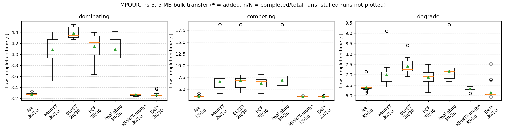
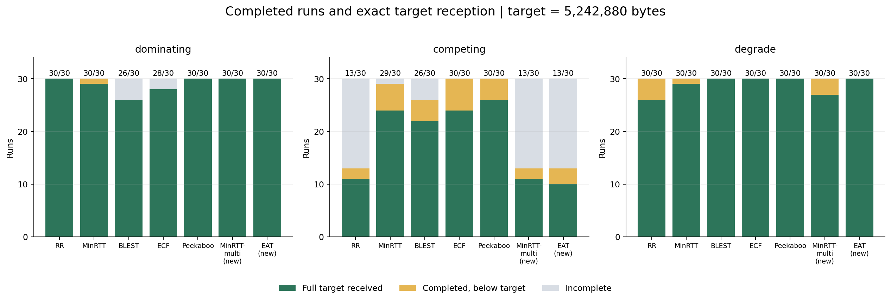
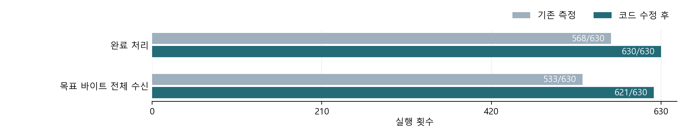
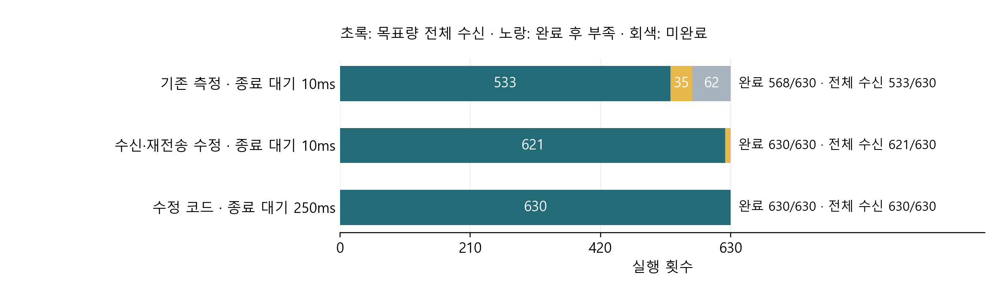

## 1. 2주차 작업 내용

### 1-1. 기존 기준 스택의 멀티 경로 630회 측정 (제공 seed 1~10 결과와 모두 일치)

- **반복 측정 (시나리오·스케줄러별 전송 성능 확인)**
  - 사용 도구
    - run_sweep.py·mpquic-sched-lab.cc
  - 실행 규모
    - 3시나리오 × 7스케줄러 × 30seed = 630회. 누락·중복·실행 오류 0건
  - 측정 구성
    - 제공 01+02 패치를 적용한 기준 스택
- **측정 조건 (스케줄러 비교에서 동일하게 유지한 설정)**
  - 목표 전송량
    - 5,242,880B. 혼잡 제어 OLIA, 설정 손실률 0, 시뮬레이션 종료 시각 60초
  - seed
    - 링크 속도·지연의 변화를 재현하는 난수 번호. 같은 번호끼리 비교

- **그림 읽는 방법 (완료한 실행의 전송 시간 분포)**
  - 세모
    - 평균
  - 상자
    - 가운데 50% 구간
  - 이름 아래 숫자
    - 완료/전체 실행 수
- **시나리오 (두 경로의 속도·지연 설정)**
  - dominating
    - 빠른 경로의 지연도 짧음
  - competing
    - 빠른 경로의 지연은 더 김
  - degrade
    - 전송 중 한 경로의 속도·지연 악화

| 측정 범위 | 완료 처리 | 목표 전체 수신 | 제공 기준 대조 |
| --- | --- | --- | --- |
| seed 1~10 · 210회 | 191/210 | 181/210 | 기준도 191·181회, 미달 조합·수신량 동일 |
| seed 11~30 · 420회 | 377/420 | 352/420 | 제공 기준 없음 · 추가 측정 |
| seed 1~30 · 630회 | 568/630 | 533/630 | 전체 바이트 미달 97회 |

### 1-2. 기존 기준 스택의 완료율·목표 바이트 수신 테스트 (완료 568회·전체 수신 533회)

- **수신 판정 (완료 처리와 목표량 전체 수신 구분)**
  - 완료 처리
    - 목표보다 최대 3,000B 부족해도 코드 기준 충족
  - 전체 수신
    - 목표 5,242,880B 정확 수신
- **기존 측정 결과 (그림 색상별 수신 상태)**
  - **초록**
    - **전체 수신 533회**
  - **노랑**
    - **완료 처리됐지만 목표량 미달 35회**
  - **회색**
    - **완료 기준 미충족 62회**
  - seed 1~10의 바이트 미달 29회는 제공 기준과 동일. 추가 seed 11~30에는 제공 기준 없음

---

### 1-3. 기존 기준 스택의 전송 분배 테스트 (시나리오별 경로 사용 비율 확인)

- **경로별 전송 비율 (완료한 실행에서 두 경로를 사용한 비중)**
  - IP 계층 수신 바이트 기준. 헤더·재전송 포함
  - MinRTT-multi의 경로 1 비율
    - dominating 67.5%
    - competing 60.9%
    - degrade 37.7%
- **통계·자료 보존 (이후 스케줄러 비교에 사용할 측정 기록)**
  - stats.py로 평균·중앙값·p90(상위 10% 경계)·95% 수신 시간 집계
  - 같은 seed끼리의 시간 차이·신뢰구간 계산. baseline.csv·명령·그림 동결 완료

## 2. 문제 상황 - 미완료 62회 원인 분석·수정

### 2-1. 원인별 유효 수정 결과 (미완료 62회 모두 전체 수신)

- **중복 수신 처리 수정 (이미 전달한 데이터의 중복 반영 방지)**
  - 원인
    - 전달이 끝난 중복 데이터로 수신 위치 계산과 실제 전달량 불일치. 미완료 54회 발생
  - 수정
    - 이미 전달한 범위 제외·실제 추출량만 수신 위치에 반영
  - **결과**
    - **해당 54회 모두 완료 처리·목표량 전체 수신**
- **재전송 판단 수정 (유실된 데이터의 재전송 누락 방지)**
  - 원인
    - 네트워크 큐(FqCoDel)의 지연 목표 초과로 IPv4 조각 폐기. 재전송 판단이 누락돼 8회 미완료
  - 수정
    - ACK(수신 확인) 번호가 송신 목록에 없어도 번호 차이로 손실 검사 수행
  - **결과**
    - **해당 8회 모두 완료 처리·목표량 전체 수신**

- **수정 통합 결과 (종료 대기 10ms로 630회 재실험)**
  - **완료 처리 630/630회. 목표량 전체 수신 621/630회**
  - 기존 미완료 62회
    - 제공 seed 1~10의 19회는 기준과 동일
    - 추가 seed 11~30의 43회는 제공 기준 없음

### 2-2. 종료 대기 250ms 적용 테스트 (630회 모두 완료·목표량 전체 수신)

- **종료 대기 검증 (미달 9회 원인 확인·전체 630회 검증 완료)**
  - 원인
    - 완료 후 10ms에 종료해 후속 바이트 수신 전에 측정 종료. 기존 10ms 결과에서 목표량 미달 9회 발생
  - 별도 실험
    - 대기 10ms → 250ms 변경 후 9/9회 전체 수신. 기록된 완료 시각 동일
  - 기본 10ms 결과의 미달 9회
    - 기존 미달 5회 + 수정 후 신규 미달 4회
  - 전체 재검증
    - CompletionGraceMs=250 적용, 3시나리오 × 7스케줄러 × 30seed = 630회
  - **결과**
    - **완료 처리 630/630회**
    - **목표 5,242,880B 전체 수신 630/630회**
    - **누락·중복·실행 오류 0건**
  - 조합별 결과
    - 21개 스케줄러–시나리오 조합 각각 30/30회 완료 처리·전체 수신
  - 대조
    - 기존 10ms 결과와 630회 모두 기록된 완료 시각 동일. 종료 대기만 변경
- **전송 시간 변화 (수정 전후 모두 완료한 같은 seed끼리 비교)**
  - 대상
    - competing·MinRTT-multi의 공통 완료 seed 13개
  - 평균 시간
    - 3.4185초 → 3.7220초. **0.3035초 증가**
  - 비교 조건
    - 수정 전후 모두 완료 처리 후 10ms 종료. 종료 대기 250ms 검증에서도 기록된 완료 시각 동일

## 3. 다음 작업 - 3주차 스케줄러 연결·고정 비율 검증

- **스케줄러 연결 (ID 7에 신규 실험 슬롯 추가)**
  - MinRTT-multi와 같은 초기 동작을 연결하고 호출·결정 로그 확인
- **고정 비율 검증 (두 경로에 지정한 전송량 비율 확인)**
  - BytesToRatio 유틸과 선택형 계측 추가. 분배 비율 0.3/0.7·0.1/0.9·0.5/0.5 테스트
  - 검증 항목
    - 경로 제약 구간 제외 실제 분배 오차 ±5%, 결정 로그·두 경로 도착 시차 확인

## 4. 참고 자료

- 수정 코드·측정 자료 : https://github.com/JS-KETI/MPQUIC_Scheduler_Lab/pull/10
- 종료 대기 250ms 전체 재검증 자료 : https://github.com/JS-KETI/MPQUIC_Scheduler_Lab/tree/fix/%239-week2-incomplete-diagnosis/artifacts/week2-completion-2026-10-08/run-01
- 기존 630회 기준 자료 : https://github.com/JS-KETI/MPQUIC_Scheduler_Lab/tree/main/artifacts/week2-2026-10-02/run-01
- **630개 시행 테스트 결과**
  - **각 시행 원본 (시나리오·스케줄러·seed별 측정값 630개)**
    - 원본 측정 CSV : https://github.com/JS-KETI/MPQUIC_Scheduler_Lab/blob/fix/%239-week2-incomplete-diagnosis/artifacts/week2-completion-2026-10-08/run-01/results.csv
  - **이후 작업에 사용할 기준값 SET (완료 처리·전체 수신 각각 630/630회)**
    - 기준값 SET (측정값·통계·그림 묶음) : https://github.com/JS-KETI/MPQUIC_Scheduler_Lab/tree/fix/%239-week2-incomplete-diagnosis/artifacts/week2-completion-2026-10-08/run-01
    - 기준값 통계 CSV (21개 조합별 평균·중앙값·p90·완료율·신뢰구간) : https://github.com/JS-KETI/MPQUIC_Scheduler_Lab/blob/fix/%239-week2-incomplete-diagnosis/artifacts/week2-completion-2026-10-08/run-01/analysis/summary.csv
  - **스케줄러별 테스트 결과 그래프**
    - 목표 데이터를 전송하는 데 걸린 시간과 반복 테스트 간 시간 차이
    - 전체 테스트 중 전송을 마친 비율
    - 두 통신 경로가 각각 받은 데이터의 비중
    - 그래프 보기 : https://github.com/JS-KETI/MPQUIC_Scheduler_Lab/tree/fix/%239-week2-incomplete-diagnosis/artifacts/week2-completion-2026-10-08/run-01/figures
