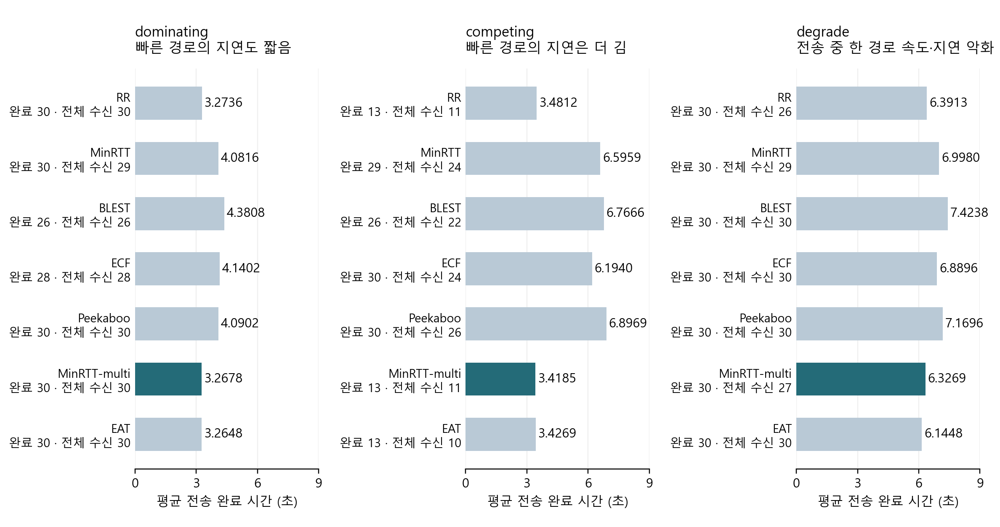

## 1. 2주차 작업 내용

### 1-1. 멀티 경로 스케줄러 630회 측정 (제공 seed 1~10 결과와 모두 일치)

- **수행:** run_sweep.py·mpquic-sched-lab.cc 사용 → 3시나리오 × 7스케줄러 × 30seed = 630회. 누락·중복·실행 오류 0건.
- **조건:** 목표 5,242,880B, 혼잡 제어 OLIA, 설정 손실률 0, 시뮬레이션 종료 시각 60초. seed는 링크 변동을 재현하는 난수 번호.

평균 시간은 완료 처리된 실행만 집계. 그림의 “완료”는 목표보다 최대 3,000B 부족해도 충족하는 코드 기준, “전체 수신”은 목표 5,242,880B 정확 수신.

| 측정 범위 | 완료 처리 | 목표 전체 수신 | 제공 기준 대조 |
| --- | --- | --- | --- |
| seed 1~10 · 210회 | 191/210 | 181/210 | 기준도 191·181회, 미달 조합·수신량 동일 |
| seed 11~30 · 420회 | 377/420 | 352/420 | 제공 기준 없음 · 추가 측정 |
| seed 1~30 · 630회 | 568/630 | 533/630 | 전체 바이트 미달 97회 |

- **바이트 미달 97회:** 완료 처리됐지만 전체 수신 미달 **35회**, 완료 기준 미충족 **62회**. seed 1~10의 29회는 제공 기준에도 존재.
### 1-2. 통계·경로 분배 분석 (측정 자료·명령·그림 동결 완료)

- **산출물:** 완료율·평균·중앙값·p90(상위 10% 경계)·목표 95% 수신 시간, 같은 seed끼리의 시간 차이·95% 신뢰구간·유의확률 집계. 그림 3종과 baseline.csv 보존.
- **주 비교 대상 MinRTT-multi:** dominating 평균 3.2678초, 빠른 경로 전송 비율 67.5%. competing은 13/30회 완료, 목표 95% 수신은 30/30회·평균 3.3656초.

---

## 2. 문제 상황 - 미완료 62회 원인 분석·수정

### 2-1. 같은 시나리오·스케줄러·seed 재실험 (미완료 62회 모두 전체 수신)

- **최초 문제 상황(현상)**
  - 7개 스케줄러·시나리오 조합에서 62회 미완료. 제공 seed 1~10의 19회는 기준과 동일, 추가 seed 11~30의 43회는 제공 기준 없음.
- **문제 정의·식별**
  - 54회: 이미 전달한 중복 데이터가 수신 버퍼에 들어가, 수신 위치 계산과 실제 전달 바이트가 달라짐. 8회: 네트워크 큐(FqCoDel)의 지연 목표 초과로 IPv4 조각(분할 패킷) 폐기, 재전송 판단 누락.
- **접근(수정) 방법**
  - QuicStreamBase::Recv의 중복·부분 중복 처리와 실제 수신량 계산 수정. QuicSocketTxBuffer::OnAckUpdate의 손실 판단 보완. 종료 표시(FIN) 보존 및 수신 버퍼 부분 읽기 수정.

| 원인별 검증 테스트 | 완료 처리 | 전체 수신 | 확인 결과 |
| --- | --- | --- | --- |
| 종료 시각 60 → 300초 | 0/62 | 0/62 | 수신량 동일 · 시간 연장 효과 없음 |
| 수신 버퍼 부분 읽기만 수정 | 0/62 | 0/62 | 개별 버퍼 결함 확인 · 미완료는 유지 |
| 중복 수신 처리만 수정 | 54/62 | 54/62 | 중복 데이터 관련 54회 복구 |
| 재전송 판단만 수정 · 나머지 8회 | 8/8 | 8/8 | IPv4 조각 유실 관련 8회 복구 |
| 수정 통합 · seed 1~30 전체 | 630/630 | 621/630 | 기존 미완료 62회 모두 전체 수신 |
| 남은 9회 · 종료 대기 10 → 250ms | 9/9 | 9/9 | 후속 바이트 수신 · 완료 시각 동일 |

- **결과**
  - 기본 종료 대기 10ms에서 전체 수신 미달 9회 유지: 기존 미달 5회 + 수정 후 신규 미달 4회. 별도 250ms 대기 실험에서는 9회 모두 전체 수신.
  - 수신·재전송·FIN 단위 검증 통과. 관찰 옵션 전후 62회 결과 일치. 동결 기준 자료 27개 파일의 해시(내용 식별값) 유지.
### 2-2. 남은 확인·다음 작업 (시간 증가 및 기준선 채택 검토)

- **전송 시간:** competing·MinRTT-multi의 수정 전후 공통 완료 seed 13개 평균 3.4185 → 3.7220초, **0.3035초 증가**. 시간 증가 원인과 남은 9회 종료 처리 검토.
- **게이트 2:** dominating 평균의 95% 신뢰구간 폭(상한-하한) 기준 0.1초. MinRTT-multi는 기존 0.0130초 → 수정 0.0257초로 충족. MinRTT·ECF·Peekaboo는 수정 후에도 0.1647~0.1751초로 초과. 적용 대상·기준선 확정 → 기준 충족 여부 판정 → 3주차 진입 결정.
- 수정 코드·측정 자료 : https://github.com/JS-KETI/MPQUIC_Scheduler_Lab/pull/10
- 기존 630회 기준 자료 : https://github.com/JS-KETI/MPQUIC_Scheduler_Lab/tree/main/artifacts/week2-2026-10-02/run-01
